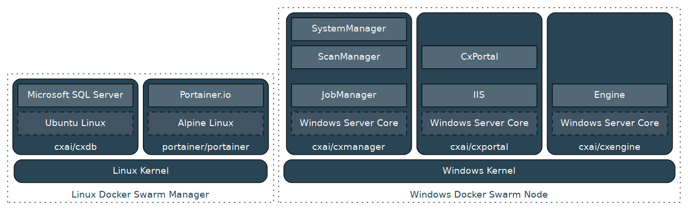
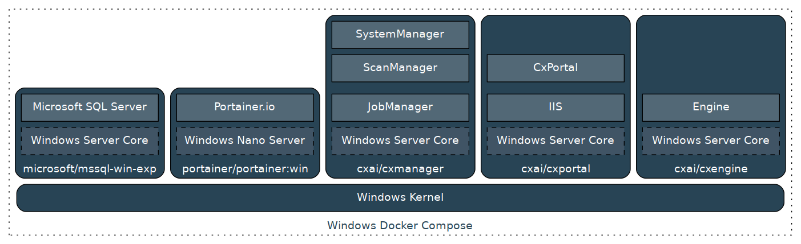

# Building CxSAST on Docker

## Build architecture

### Cross-platform


The procedure below describes a **cross platform** docker build and uses a Linux host for the DB and portainer and a virtual box [Windows Docker VM](https://app.vagrantup.com/StefanScherer/boxes/windows_2016_docker) for the rest of Checkmarx components. To run or build containers on the Linux host you will need a VM with Docker like [this one](https://github.com/alexivkin/windows_2016_core). It needs to be configured as described in the [Notes](#notes) section.


### Windows only

Windows-only build is much simpler because it does not use docker swarm and is on one node only. To build on windows you will need to change the below procedure to:
* Run [MSSQL Windows container](https://hub.docker.com/r/microsoft/mssql-server-windows-express/). It has slightly different setup from the Linux version. See notes below for more details.
* Change bash for the appropriate powershell commands. For more see [below](#running-everything-on-a-docker-windows-host).

## Cross-platform build
This build makes a full use of the docker hostname resolution and the swarm overlay network to resolve container names across linux and windows nodes, so you don't have to worry about container IPs. As any cross-platform it's much more complex than a homogeneous platform build would be.

### Create a swarm and an attachable overlay network
* On the Linux docker host run

`docker swarm init --advertise-addr <linux docker IP from private net with win VM>  --listen-addr <same ip>`

* Join the windows node into the swarm

`docker -H tcp://windowsip swarm join --token SWMTKN-1-tockenheretockenheretockenhere <linux docker IP>:2377`

* Create the attachable overlay network

`docker network create -d overlay --attachable build-net`

* Get the network created on the windows host
There is probably a bug causing instability in an overlay network between a swarm linux manager and a swarm windows node. The swarm node may occasionally stop responding to ack-s, causing it to be listed as failed and having all cross-node traffic to be dropped. To make the network more-or-less stable you need to start an overlay-connected container *directly* on the windows host using the windows docker client. So:
 * Login into the windows docker hosts
 * Run `docker run --rm -it --network build-net microsoft/nanoserver powershell`
 If it fails keep trying till it works. Bugs logged for it:  [1](https://github.com/docker/swarm/issues/2161),
 [2](https://github.com/docker/swarm/issues/2687),
 [3](https://github.com/moby/moby/issues/29024).
To make it work start a windows continer right after the windows node drops. When it rejoins there is a period of time when the network works and if a container is bound during that time, the network will continue to work.

#### Build the builder

First you will need to build CxBuilder. It is necessary do it, so that CxSetup.exe is not included in the layers of the Checkmarx docker images, since `squash` is [not yet working](https://github.com/moby/moby/issues/34565) on windows docker.

CxBuilder is just a web server, bound to a local host and serving content of its own directory. CxBuilder needs to be created only once, the first time you do the build. You can reuse the image in the subsequent builds.

`docker build -t cxai/cxbuilder CxBuilder/`

#### Start the builder to serve the necessary components for Cx builds

Get the latest unzipped Checkmarx Installer (CxSetup.exe) and save it into the CxBuilder folder. Then run the following from a folder above CxBuilder

`docker run --name cxbuilder --rm -d  --network build-net -v $(pwd)/CxBuilder:/www cxai/cxbuilder`

#### Build the DB container

CxDB is a container based off microsoft/mssql-server-linux, with telemetry disabled by default. You can skip this step and run the microsoft/mssql-server-linux image directly instead if you don't care about M$ sniffing your activities.
Unlike Microsoft's [approach](https://docs.microsoft.com/en-us/sql/linux/sql-server-linux-customer-feedback) this image has the proper setting baked into the image.

#### Start the db
Specify a password and run the MSSQL container

```
export sa_password=<your password here>
docker run -h cxdb --name cxdb -e SA_PASSWORD=$sa_password --network build-net -v cxdb:/var/opt/mssql -d cxai/cxdb
```

The -h is so the server gives it the correct name. Unlike the Windows docker container for MSSQL, the db server name does not come from --name, but from -h. Running the DB contianer for the first time will create the cxdb volume with the actual database.

#### Verify the build environment

Connect to the docker on windows and make sure it's working.
```
export DOCKER_HOST=tcp://<windows host ip>
docker version | grep Arch
```

Make sure you can reach the builder from inside the windows docker server
```
docker run --rm --network build-net microsoft/nanoserver powershell Invoke-WebRequest http://cxbuilder:8000/ -usebasicparsing | grep StatusCode
```

Should show 200

Now make sure the DB is reachable and works. The first time you run the command below will pull in the microsoft/mssql-server-windows-express image

```
docker run --rm -it --network build-net microsoft/mssql-server-windows-express sqlcmd -S cxdb -U sa -P $sa_password -Q "select name from sys.databases; select @@servername + '\' + @@servicename"
```

It should show four databases and the server name

#### Build Cx Managers image

`docker build -t cxai/cxmanagers --build-arg CX_DOWNLOAD_URL=http://cxbuilder:8000/CxSetup.exe --build-arg SQL_SERVER=cxdb --build-arg SQL_PWD=$sa_password --network build-net CxManagers`

This will also populate the DB with the default schema. Check the logs on cxdb to make sure the db installation completed successfully, otherwise you risk having weird startup errors for the Cx managers.

`docker logs cxdb`

Look for fatal errors during the DB creation.

#### Build Cx Portal image

`docker build -t cxai/cxportal --build-arg CX_DOWNLOAD_URL=http://cxbuilder:8000/CxSetup.exe --build-arg SQL_SERVER=cxdb --build-arg SQL_PWD=$sa_password --network build-net CxPortal`

#### Build Cx Engine image

`docker build -t cxai/cxengine --build-arg CX_DOWNLOAD_URL=http://cxbuilder:8000/CxSetup.exe --network build-net CxEngine`

#### Teardown the build environment

```
docker stop cxbuilder
docker stop cxdb
docker network rm build-net
```

Keep the swarm configured, it will be needed for the run-time use.

#### Take a backup of the DB
```
docker stop cxdb
docker run --rm -v cxdb:/from -v cxdb-backup:/to alpine ash -c "cp -av /from/* /to/"
docker start cxdb
```

## Notes

### Setting up the docker windows VM host
The docker windows VM needs to have the following configured:

* Add a second network interface in a private network mode (host-only mode). Simply exposing dockers port through the default NAT interface (2375 to something like 12375) would work for managing remote docker server with a docker client. However, since we are using docker swarm and we can not change what DNS ports that the swarm manager expects, the only alternative is a private network. Also there is a bug in the VirtualBox NAT interface implementation aborting fast running streams, like the one that happens during DB provisioning by the installer.
* Enable dockerd remote APIs - `echo '{ "hosts": ["tcp://0.0.0.0:2375", "npipe://"] }' | out-file -encoding ascii c:\ProgramData\docker\config\daemon.json` then `restart-service docker`
* Turn off windows firewall within the guest. Either do it completely `NetSh Advfirewall set allprofiles state off` or just for the necessary ports.

### Running everything on a docker windows host

To change to the Windows version of the MSSQL Express container run it with the following options:
```
docker run --name sqlexpress -e 'ACCEPT_EULA=Y' -e 'MSSQL_PID=Express' -e 'MSSQL_SA_PASSWORD=password' -p 1433:1433 -e attach_dbs="[{'dbName':'CxDB','dbFiles':['C:\\DATA\\CxDB.mdf','C:\\DATA\\CxDB_log.ldf']},{'dbName':'CxActivity','dbFiles':['C:\\DATA\\CxActivity.mdf','C:\\DATA\\CxActivity_log.ldf']]
-v ./data:C:/DATA -d microsoft/mssql-server-windows-express
```

You will need to grab for CxDB an CxActivities from the mssql image after the CxManager the installation

As of Dec 2017 Microsoft provides MSSQL windows docker images only in Express and Development versions. If you need Enterprise versions you will need to run MSSQL Linux docker images per Microsoft's [MSSQL Linux Container docs](https://docs.microsoft.com/en-us/sql/linux/sql-server-linux-configure-docker).
